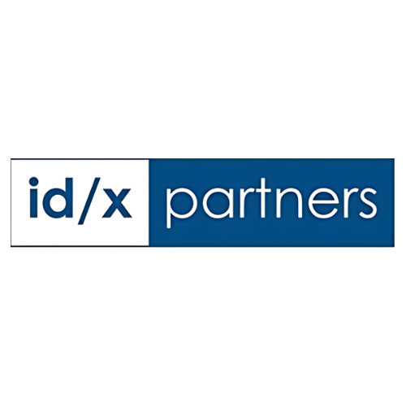
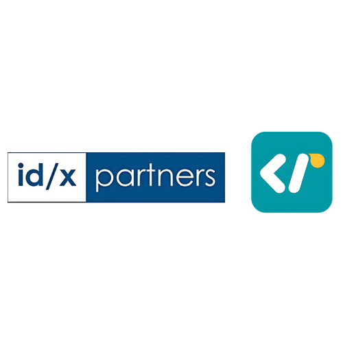

<p align="center">
  <a href="#">
    
    
    
    
    
    
    
    
    
  </a>
</p>

#  ID/X Partners Project Based Virtual Internship Weekly Challenge 


## Summary 📚
This repository contains the weekly challenges of the ID/X Partners Project Based Virtual Internship Program. The challenges are based on the following topics:

- Week 1: Introduction to Data Science & Business Understanding
- Week 2: Big Data and SQL Querying
- Week 3: Machine Learning


This weekly challenges are designed to test the knowledge of the interns on the topics covered in the weekly sessions. The interns dive deep into the data science role and learn how to apply the concepts in real-world scenarios.

## Acknowledgements ⭐

I would like to thank [ID/X Partners](https://www.idxpartners.com/) for providing this opportunity to learn and grow in the field of data science. I would also like to thank [Mr. Louis Madaerdo Sotarjua](https://www.linkedin.com/in/louismadaerdo/) for his guidance and support throughout the the challenges until week 3.

## End 🎓

```py
print("Thank you for visiting my repository!")
```

> Thank you for visiting my repository! If you found this repository useful, please don't forget to give it a star. If you have any questions, feel free to open an issue or contact me on [LinkedIn](https://www.linkedin.com/in/azarya-yehezkiel/).

